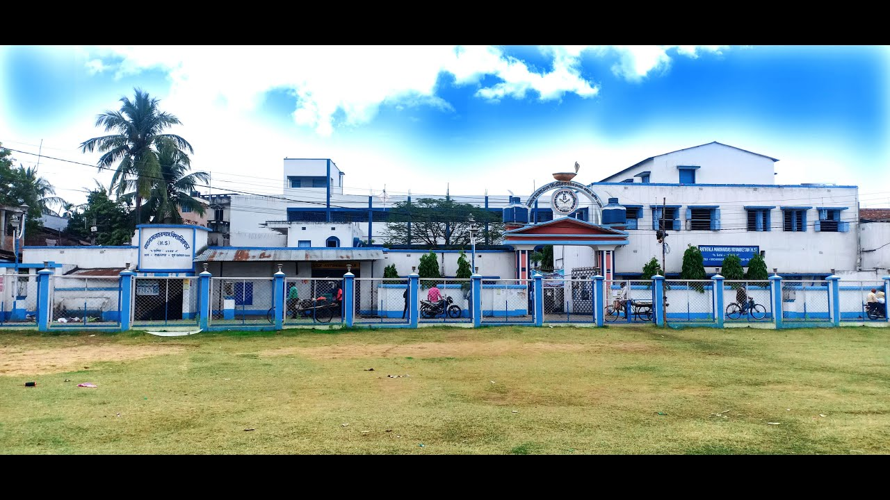

# 📚 Rathtala Manohardas Vidyaniketan (H.S.)

> Official website for Rathtala Manohardas Vidyaniketan - A prestigious educational institution established in 1968.



## 🌐 Live Demo

[View Website](https://rmdvhs.vercel.app/)

## ✨ Features

- **Responsive Design** - Works seamlessly on mobile, tablet, and desktop
- **Modern UI** - Clean, professional design with smooth animations
- **Interactive Elements** - Scroll blur effect, reveal animations, interactive map
- **Google Maps Integration** - Live embedded map showing school location
- **Optimized Performance** - Lazy loading, smooth scrolling, minimal dependencies

## 📑 Sections

| Section | Description |
|---------|-------------|
| **Hero** | Full-screen landing with scroll blur effect |
| **About** | School history, stats, and key information |
| **Head Master's Desk** | Leadership profile with awards |
| **Infrastructure** | Facilities overview (30 rooms, library, WiFi, etc.) |
| **Faculty** | Interactive chart showing 23 teachers |
| **Contact** | Phone, address, hours & Google Maps |

## 🛠️ Technologies

- **HTML5** - Semantic markup
- **CSS3** - Grid, Flexbox, Animations, CSS Variables
- **JavaScript** - Intersection Observer API, Scroll effects
- **Google Fonts** - Poppins & Inter
- **Google Maps** - Embedded location

## 📁 Project Structure

```
School/
├── index.html      # Main HTML file
├── style.css       # All styles
├── script.js       # JavaScript functionality
├── favicon.png     # Site favicon
├── wideshot.jpg    # Hero background image
├── image1.jpg      # About section image
├── hm.jpg          # Head Master photo
└── README.md       # This file
```

## 📍 School Information

- **Location:** Rathtala, Burdwan Municipality, West Bengal - 713102
- **Established:** 1968
- **Type:** Boys School (Grades 5-12)
- **Medium:** Bengali
- **Board:** State Board
- **Contact:** +91 89186 68852

## 📄 License

This project is open source and available under the [MIT License](LICENSE).

---

<p align="center">
  Made with ❤️ by Bhoid for Rathtala Manohardas Vidyaniketan
</p>
